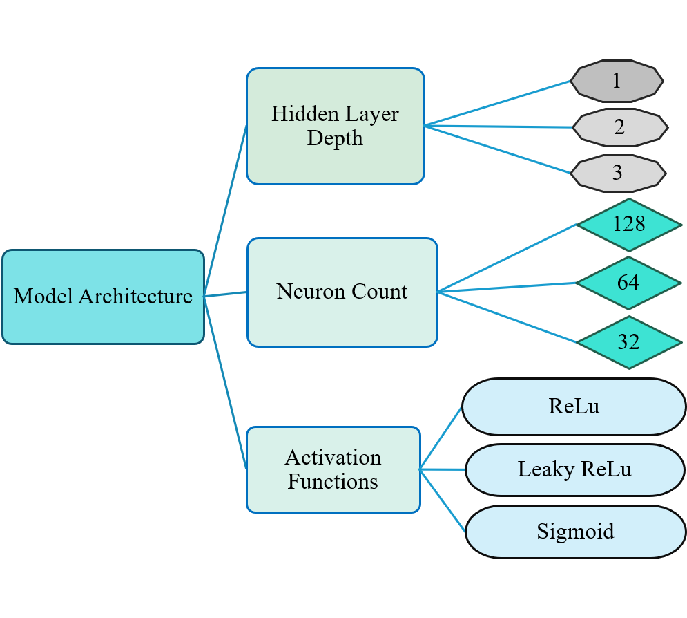
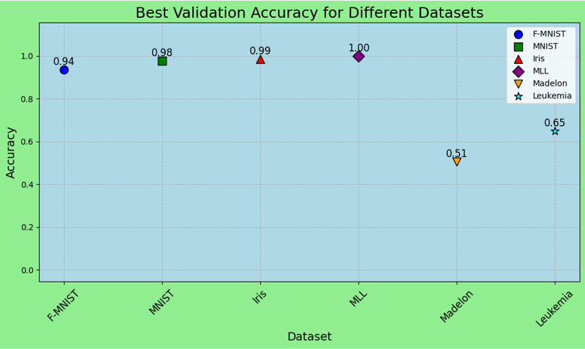

# Neural-Networks-Investigating-Effects-of-Layer-Depth-Neuron-Count-and-Activation-Functions

###### **Feedforward Neural Network from Scratch**

This repository contains a \*\*Python + NumPy implementation of a feedforward neural network\*\* built entirely from scratch. Developed for \*\*CSI 536\*\*, the project explores how neural networks learn, transform data layer-by-layer, and generalize to unseen examples without using high-level deep learning libraries.

###### **Project Overview**

The goal of this project was to build a functioning neural network from scratch to understand \*\*weights, activations, layer interactions\*\*, and the effect of architectural choices on performance.

###### **Key Features**

\- **Configurable Architecture:** 2–4 layers with customizable hidden neurons.

\- **Activation Functions:** ReLU, Sigmoid, and Leaky ReLU.

\- **Custom Optimizers:** Batch Gradient Descent and Adam Optimizer (from scratch).

\- **Multi-class Classification:** Softmax output with Categorical Cross-Entropy loss.

###### **Datasets Evaluated**

| Dataset   | Instances | Features | Classes | Type            |

|-----------|----------|---------|--------|--------------------|

| F-MNIST   | 70,000   | 784     | 10     | Image (Tabular)    |

| MNIST     | 70,000   | 784     | 10     | Image (Tabular)    |

| Iris      | 150      | 4       | 3      | Classic Low-dim    |

| MLL       | 72       | 5,848   | 3      | High-dimensional   |

| Madelon   | 2,600    | 500     | 2      | Artificial         |

| Leukemia  | 72       | 7,129   | 2      | High-dimensional   |

###### **Key Findings**

\- **Optimizers:** Adam consistently outperformed Batch Gradient Descent, especially on MNIST/F-MNIST.

\- **Activation Functions:** Leaky ReLU prevented "dead neurons" and achieved the highest accuracy. Sigmoid struggled in deeper networks.

\- **Network Depth:** 3–4 layers improved performance on complex datasets, while simpler tasks like Iris worked well with 2 layers.

\- **Dimensionality:** High-instance datasets performed well; high-dimensional low-sample datasets (e.g., Leukemia) were challenging.

###### **Getting Started**

###### **Colab Notebooks**

All notebooks are shared with \*\*editor access\*\*. To avoid accidental edits, consider downloading them to your own environment.

1\. **MNIST/F-MNIST:** \[ICSI\_536\_Projects\_MNIST\_FMNIST.ipynb](https://colab.research.google.com/drive/196LaYGn15E3WngLrmtQKPjzAPrmXJK62?usp=sharing)  

&nbsp;  - Requires Kaggle API key for dataset download.

2\. **IRIS \& Other Datasets:** \[ICSI\_536\_Projects\_IRIS\_and\_others.ipynb](https://colab.research.google.com/drive/1odcjhmLmNHk9xO8Y258fOhDv3Kkhay2I?usp=sharing)

3\. **Plotting Results:** \[ICSI\_536\_Projects\_Plot\_All\_results.ipynb](https://colab.research.google.com/drive/1oXDWfBN8m4q3pAtry3YzXkxSOVBwsuex?usp=sharing)

###### **How to Run**

1\. Open the notebook in Google Colab.

2\. Upload to your own Colab environment (optional but recommended).

3\. Run \*\*Runtime > Run all\*\*.

4\. For MNIST/F-MNIST, replace the Kaggle API key in the second cell if necessary.

###### Project Status

✅ Completed — Baseline implementation

🔧 Open for enhancements and upgrades

###### Contributors

\- Tajkia Nuri Ananna  

\- Nowshin Tasnim  

\- Ali Salehi Darjani  

\- Joy Saha  

University at Albany, SUNY

###### License

This project is released under the \[MIT License](LICENSE).

